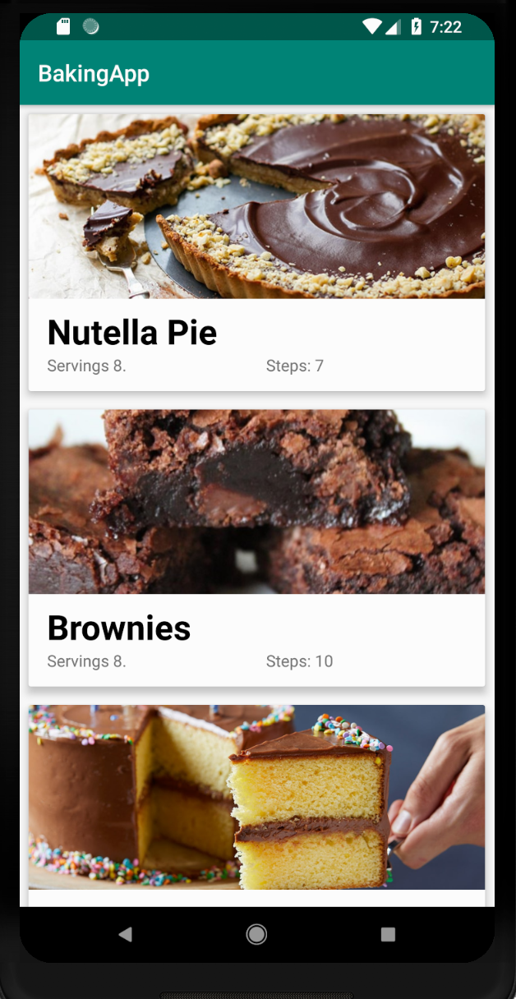
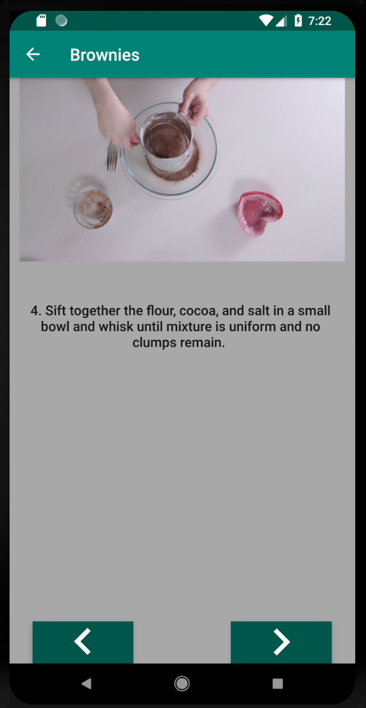
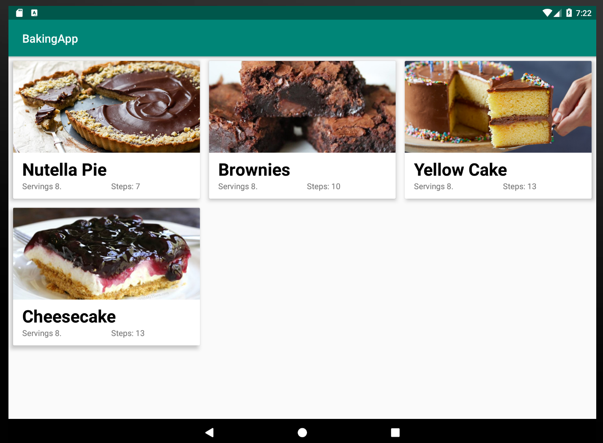
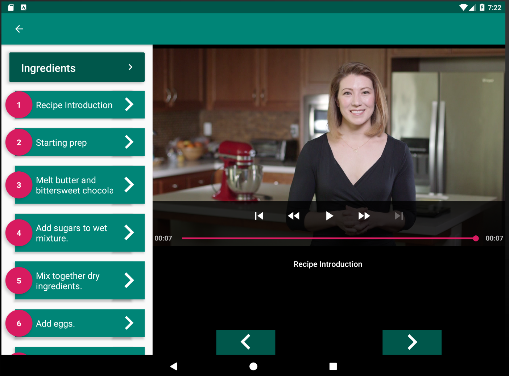

# BakingApp
Assignment form the Android Nanodegree from Udacity


## App Description
The assignment is to create a Android Baking App that will allow Udacity’s resident baker-in-chief, Miriam, to share her recipes with the world. You will create an app that will allow a user to select a recipe and see video-guided steps for how to complete it.

[The recipe listing is located here][link].

  [link]: http://go.udacity.com/android-baking-app-json


The JSON file contains the recipes' instructions, ingredients, videos and images you will need to complete this project. Don’t assume that all steps of the recipe have a video. Some may have a video, an image, or no visual media at all.

One of the skills you will demonstrate in this project is how to handle unexpected input in your data -- professional developers often cannot expect polished JSON data when building an app.


## Screenshots - Portrait

Here is how the app looks in portrait mode. 

<p float="left">
  
  
</p>

## Screenshots - Tablet

Here is how it looks in landscape mode on Tablet devide.

<p float="left">
  
  
</p>


## Android Setup

This project consists of a single module. Open the app in Android Studio, fire up and Emulator or Device, build the code and intall the APK.

Or on the command line:
```
./gradlew installDebug
``` 


## Deployment

Add additional notes about how to deploy this on a live system

## Built With

* [Dagger2](https://google.github.io/dagger/) - Used to build the dependency graph.
* [Retrofit](https://square.github.io/retrofit/) - HTTP Client for Android applications.
* [Exoplayer](https://github.com/google/ExoPlayer) - ExoPlayer is an application level media player for Android. 

## Contributing

This project is cloded for contributions and not maintained. It's for learning and showcase purposes only.


## License

This project is licensed under the MIT License - see the [LICENSE.md](LICENSE.md) file for details

## Acknowledgments

* [Udacity Android Nanodegree](https://eu.udacity.com/course/android-developer-nanodegree-by-google--nd801). 

### General TODOs
Main epics coded while developing this app. 

* [X] Set up Recycler view for MainFragment with Card Views <br>
* [X] Setup Dagger 
* [X] Design and implement View Model Skeleton with Repository Patten
* [X] Implement model of Json objects (Recipe, Steps, Ingredients)
* [X] Implement Loading Animation (ProgresBar)
* [X] Implement Json fetching with Retrofit as part of Repository
* [X] Support fallback case if Network request fails to deliver the recipes (caching?)
* [X] Show error if Data Loading fails
* [X] Implement Pull to Refresh
* [X] Clicking on a card opens a new Fragment
* [X] Implement list of steps according to mock up, as a Recycler View List
* [X] Clicking on Steps, opens detailed step View which will hold video.
* [X] Implement View Playback of the Recipes using Exo Player
* [X] Map images to each recipe by ID.
* [X] Restore playback state on rotation and add full screen.
* [X] Make ingredients card clickable and show ingredients list in a fragment
* [X] Use ViewPager to navigate across steps
* [X] Implement Adaptative UI for Tablets.
* [X] Application has a companion homescreen widget. 
* [X] Widget displays ingredient list for desired recipe.
* [X] Write Esspresso Tests to test aspects of the UI.
* [ ] Cache Picasso images on OkHTTP Cache https://stackoverflow.com/questions/23978828/how-do-i-use-disk-caching-in-picasso
* [ ] Serve recipes JSON from own free Json server
* [ ] Serve image thumbnails from own free image hosts

### Mobius TODOS
* [X] Implement in Mobius navigate to recipe details step. 
* [X] Show error view when failing to fetch items.
* [X] Unit test all Mobius code
* [X] Use loading state to show or hide loading bar.
* [X] Implement pull to refresh.
* [ ] Connect Mobius loop to ViewModel and clean up duplicated task and code.
* [ ] Remove non-Rx network requests and clean up Repository class
* [ ] Add error handling to Mobius model, and use snackbar to show errors. 
* [ ] Consider having connection as part of the model. 
* [ ] Enable Home View in offline mode. 
* [ ] Write Unit Tests  
* [X] Host JSON in own server/site/JSON host
